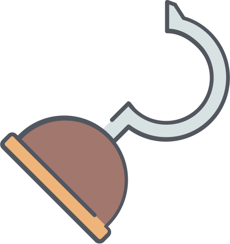

<div align="center">
  <br>
  
  <br>
  <br>

  # GitHub Webhook Handler

</div>

[](https://github.com/loilo/github-webhook-handler/actions)
[](https://packagist.org/packages/loilo/github-webhook-handler)

Handle GitHub webhooks with PHP.

## Installation
```bash
composer require loilo/github-webhook-handler
```

## Usage
Start by creating a handler:

```php
$handler = new Loilo\GithubWebhook\Handler($secret);
```

`$secret` is the webhook secret defined in the GitHub backend. It *can* be omitted, however providing it is *strongly recommended* to prevent abuse of the endpoint.

To handle a request (specifically, a [PSR-7 `ServerRequestInterface`](https://www.php-fig.org/psr/psr-7/#321-psrhttpmessageserverrequestinterface)), pass that request to the `handle` method:

```php
$delivery = $handler->handle($request);
```

If the webhook request is invalid, [a failure-specific exception](src/Exceptions) will be thrown. Otherwise, the method returns a [`Delivery`](src/Delivery.php) object which provides access to the event that caused the hook request and to the payload data that was sent along with it:

```php
// Get the triggered event (e.g. 'push')
$delivery->event();

// Get the whole webhook payload as an associative array
$delivery->payload();

// Get a nested path in the payload (returns `null` if the path doesn't exist)
$delivery->payload('repository.full_name');
```

### Single-File Endpoint

There may be very simple cases where you're not using a PHP framework for your script and just want to put a single PHP file endpoint out there. To avoid having to deal with exceptions and creating appropriate error responses, you may use the `respond()` method:

```php
$delivery = $handler->respond($request);
```

Now you can safely use the `$delivery` object without any further worries — if validation of the webhook request fails, the handler will set an appropriate HTTP status code, print the error message and [stop script execution](https://php.net/manual/en/function.exit.php).

> **Pro Tip:** Not having a PSR-7 request object at hand? Install the [`guzzlehttp/psr7`](https://github.com/guzzle/psr7) package and use `\GuzzleHttp\Psr7\ServerRequest::fromGlobals()` to create a request object from the environment.
